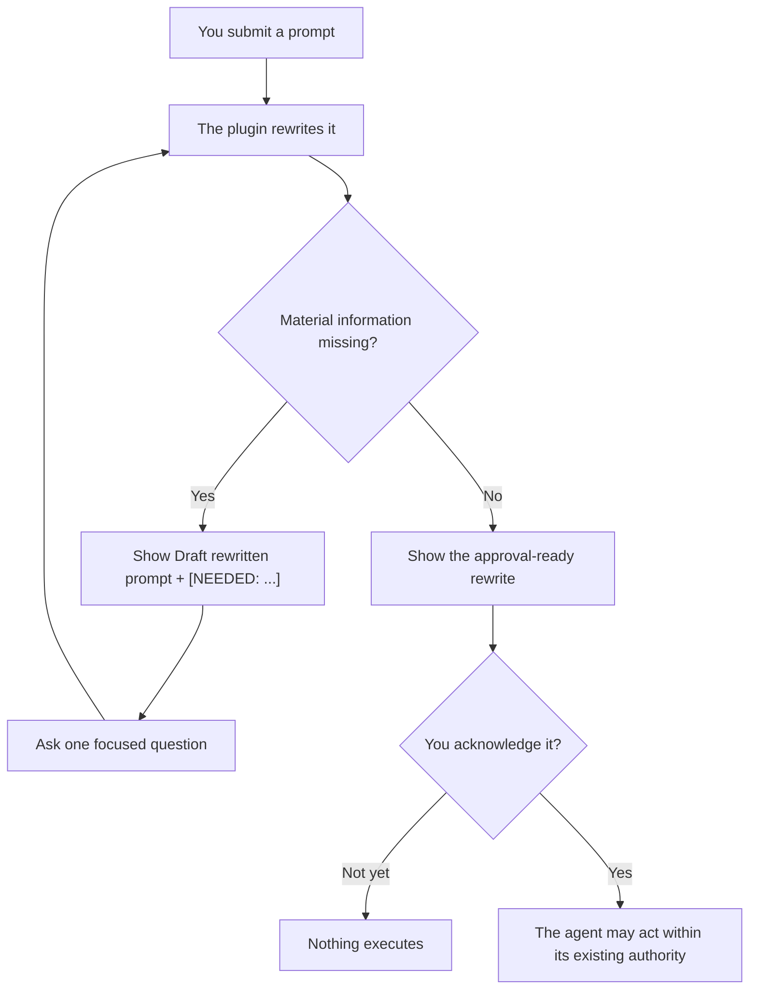

<h1 align="center">You Suck at Prompting</h1>

<p align="center">
  <strong>Good news: so do we.</strong><br>
  The plugin that gives every prompt adult supervision before your agent acts on it.
</p>

<p align="center">
  
  
  
  
</p>

<p align="center">
  <a href="#install-for-codex"><strong>Install for Codex</strong></a>
  ·
  <a href="#install-for-claude-code"><strong>Install for Claude Code</strong></a>
  ·
  <a href="#install-for-vs-code-github-copilot"><strong>Install for Copilot</strong></a>
  ·
  <a href="#watch-the-rewrite-earn-its-keep"><strong>Examples</strong></a>
  ·
  <a href="#how-the-intervention-works"><strong>How it works</strong></a>
</p>

> [!WARNING]
> **Your prompt has been placed on a Performance Improvement Plan.**
>
> This is not punitive. We have all typed “make it better” and expected a machine to reconstruct the missing fourteen paragraphs from our tone.

**You Suck at Prompting** is an installable Codex, Claude Code, and VS Code GitHub Copilot customization that visibly rewrites every task request before execution.

It preserves what you meant, identifies anything important you forgot, gives the original prompt a tiny performance review, adds bounded execution controls when the work actually needs them, protects the authority boundaries you definitely remembered to specify, and waits for your approval before the agent does anything.

In other words: it turns this—

```text
Make it better and put it on GitHub.
```

—into something an agent can execute without consulting a psychic, a lawyer, and three previous versions of you.

## Watch the rewrite earn its keep

These illustrative conversations use public, synthetic prompts—not retained user prompts. They show how specific additions to the revised prompt change what the agent does and what it can prove. They are examples, not a controlled benchmark wearing a tiny lab coat.

Every plugin response begins with the same preflight line. It appears once below because repetition is not a personality.

<details open>
<summary><strong>Example 1: “Fix it.” becomes one scoped checkout repair</strong></summary>

**You, supplying one-third of a sentence:**

```text
Fix it.
```

**The plugin, discovering that “it” is not in the issue tracker:**

Analyzing whether You Suck at Prompting… your prompt’s performance review is underway.

Draft rewritten prompt:

```text
Investigate and fix [NEEDED: the specific failure or undesired behavior]
in [NEEDED: the affected application, repository, or file].

Keep the change limited to the identified problem and verify the fix with
the smallest relevant test or reproduction.
```

Prompt performance rating: 1/5 - This prompt arrived with a verb and left the rest in another tab.

What is broken, and where are you seeing it?

Expected prompt impact: The answer determines the target, the behavior to reproduce, and the evidence required to call the fix complete.

**You, returning with the missing plot:**

```text
The checkout button in the demo store does nothing after I apply a coupon.
```

**The plugin, repeating its standard preflight and completing the rewrite:**

You Suck At Prompting Rewritten prompt:

```text
Reproduce and fix the demo store checkout button failing after a coupon is
applied. Keep the change scoped to that checkout path and preserve checkout
behavior without a coupon. Add or update a regression test for the failing
coupon flow, run the relevant tests, and report the result.
```

Prompt performance rating: 1/5 - This prompt arrived with a verb and left the rest in another tab.

Reply with an acknowledgement to use this prompt.

**You:** `yes`

**Illustrative result:** The agent reports the scoped coupon-checkout fix, identifies the changed component, and provides the passing regression-test result.

| Revised-prompt addition | Visible improvement in the result |
|---|---|
| Named failure and affected flow | The agent repairs the coupon checkout path instead of guessing what “it” meant. |
| Preserved non-coupon behavior | The fix has an explicit regression boundary. |
| Required test evidence | Completion includes a passing check, not just a confident adjective. |

</details>

<details>
<summary><strong>Example 2: a tiny task gets a receipt</strong></summary>

**You:**

```text
Create a text file named hello.txt containing hello.
```

**The plugin, with the standard preflight omitted here for brevity:**

You Suck At Prompting Rewritten prompt:

```text
Create hello.txt in the current workspace with text content exactly equal
to hello. Read the file back and report whether its contents match.
```

Prompt performance rating: 4/5 - This prompt knew what it wanted and forgot to ask for a receipt.

Reply with an acknowledgement to use this prompt.

**You:** `yes`

**Illustrative result:** The agent creates `hello.txt`, reads it back, and confirms that its content is exactly `hello`.

| Revised-prompt addition | Visible improvement in the result |
|---|---|
| Explicit workspace destination | The file lands in the intended working context. |
| Exact-content readback | The result proves the tiny task succeeded without inventing a tiny project plan. |

</details>

<details>
<summary><strong>Example 3: production does not accept a casual “yes”</strong></summary>

**You, approaching the large red button:**

```text
Deploy the checkout service from the current branch to production.
```

**The plugin, with the standard preflight omitted here for brevity:**

You Suck At Prompting Rewritten prompt:

```text
Prepare the current branch of the checkout service for a production
deployment. Identify the exact revision, run the existing build and test
checks, and produce a deployment preview that names the target environment
and rollback path. Do not change production. Stop and request separate
explicit approval before executing the deployment.
```

Prompt performance rating: 3/5 - Production was invited before the safety briefing.

Reply with an acknowledgement to use this prompt.

**You:** `yes`

**Illustrative result:** The agent reports the validated revision, passing build and tests, target environment, and rollback path. Production remains unchanged while deployment approval is pending.

| Revised-prompt addition | Visible improvement in the result |
|---|---|
| Exact revision and validation checks | The proposed deployment is tied to an auditable artifact with readiness evidence. |
| Target and rollback preview | The consequential action is reviewable and recoverable before execution. |
| Separate deployment approval | Acknowledging the rewritten prompt does not silently authorize a production change. |

</details>

## The rating you absolutely did not request

Every visible rewrite or draft also gets a `Prompt performance rating: N/5` line. The score judges the user's initial prompt exactly as submitted, before the plugin repairs it; the polished rewrite earns no extra credit. Clarifications can improve the rewritten task without retroactively raising the original prompt's rating. Five means the initial prompt was already self-contained, scoped, authorized, and verifiable. Lower scores identify missing context, contradictions, unsafe authority, or repair work. The comment is a short, playful judgment of the prompt mechanics—not of you—and stays gentle when the subject is serious.

## Your Prompting Performance Improvement Plan

| Observed behavior | Professional translation | Corrective action |
|---|---|---|
| “Make it better.” | Better has left no forwarding address. | Define the intended outcome and success check. |
| “Fix the app.” | Which app? Which failure? Which dimension? | Recover safe context or mark the missing detail as `[NEEDED: ...]`. |
| “Deploy it.” | A side effect disguised as a pronoun. | Preserve the authority boundary and wait for approval. |
| Eleven paragraphs, no actual request | Context has achieved critical mass. | Produce one self-contained, executable prompt. |
| “You know what I mean.” | The machine regrets to inform you that it does not. | State the part that changes the result. |

> [!NOTE]
> Brevity is not the problem. “Delete the obsolete test fixture in this repository and rerun the unit tests” is short and useful.
>
> “Do the thing” is also short. It is less useful.

## How the intervention works



The plugin does this for every new task request, including requests that are already clear or trivial. You installed a prompt chaperone. It takes the position seriously.

When a task genuinely needs a goal, feedback loop, staged plan, dependency graph, multiple agents, recurring checks, research, a spike, deterministic processing, or independent review, the plugin adds only the controls needed to make that execution bounded and verifiable. One-step work stays one-step work. If you explicitly request an approach that looks excessive or unsupported, the plugin asks whether to preserve or simplify it instead of quietly overruling you.

This shapes the rewritten prompt; it does not create agents, schedules, persistence, permissions, or authority that the host does not already provide.

## Install for Codex

```powershell
codex plugin marketplace add ScotTFO/you-suck-at-prompting
codex plugin add you-suck-at-prompting@scottfo
```

Review and trust the plugin hook when Codex prompts you. In Codex CLI, use `/hooks` to inspect and trust the exact command.

Start a new Codex task after installation or upgrade so the current skill and hook are loaded.

To upgrade:

```powershell
codex plugin marketplace upgrade scottfo
codex plugin add you-suck-at-prompting@scottfo
```

Then start a fresh task. Your old task has already seen too much.

## Install for Claude Code

```powershell
claude plugin marketplace add ScotTFO/you-suck-at-prompting
claude plugin install you-suck-at-prompting@scottfo
```

Use `/hooks` to inspect the installed `UserPromptSubmit` hook.

Start a new Claude Code session after installation or upgrade.

To upgrade:

```powershell
claude plugin marketplace update scottfo
claude plugin update you-suck-at-prompting@scottfo
```

## Install for VS Code GitHub Copilot

Copilot support has two parts: the plugin supplies the shared skill, and one personal instruction file makes the approval gate apply to every new Agent-mode task.

1. In VS Code settings, append this repository to your existing `chat.plugins.marketplaces` list. Do not replace marketplaces already configured there.

   ```jsonc
   "chat.plugins.marketplaces": [
     "ScotTFO/you-suck-at-prompting"
   ]
   ```

2. Open the Extensions view, search for `@agentPlugins`, find **You Suck at Prompting**, and select **Install**. Review the source and trust prompt before confirming.
3. Install the always-on instruction adapter without replacing your other Copilot instructions.

   **Windows PowerShell:**

   ```powershell
   $instructionsDirectory = Join-Path $HOME ".copilot\instructions"
   New-Item -ItemType Directory -Force -Path $instructionsDirectory | Out-Null
   Invoke-WebRequest `
     -Uri "https://raw.githubusercontent.com/ScotTFO/you-suck-at-prompting/main/plugins/you-suck-at-prompting/copilot/you-suck-at-prompting.instructions.md" `
     -OutFile (Join-Path $instructionsDirectory "you-suck-at-prompting.instructions.md")
   ```

   **macOS or Linux:**

   ```bash
   mkdir -p "$HOME/.copilot/instructions"
   curl -fL \
     "https://raw.githubusercontent.com/ScotTFO/you-suck-at-prompting/main/plugins/you-suck-at-prompting/copilot/you-suck-at-prompting.instructions.md" \
     -o "$HOME/.copilot/instructions/you-suck-at-prompting.instructions.md"
   ```

4. Start a new GitHub Copilot chat in **Agent** mode. Run **Chat: Open Customizations** and confirm that both the plugin skill and **You Suck at Prompting** instruction appear and are enabled.

Agent plugins can be disabled by enterprise policy. If the Plugins view or `chat.plugins.enabled` is unavailable, ask your administrator to allow agent plugins and this marketplace.

### Project-only Copilot installation

To keep the customization in one repository instead of your personal profile, copy these release directories into the target project:

```text
plugins/you-suck-at-prompting/skills/you-suck-at-prompting/
  -> .github/skills/you-suck-at-prompting/

plugins/you-suck-at-prompting/copilot/you-suck-at-prompting.instructions.md
  -> .github/instructions/you-suck-at-prompting.instructions.md
```

Commit those copied files if the project should share the behavior with collaborators. Start a new Agent-mode chat and verify both entries in **Chat: Open Customizations**.

Copilot coverage applies to Chat in Agent mode. It does not affect inline code completions. Copilot can select the skill automatically, while the instruction adapter supplies the always-on gate; installing only the skill leaves automatic selection best-effort.

### Copilot smoke test

1. Confirm the skill and instruction appear in **Chat: Open Customizations**.
2. Submit `Create a text file named hello.txt containing hello.` Confirm Copilot shows the rewritten prompt before using a tool or changing a file.
3. Reply `yes`. Confirm Copilot performs the task once without showing the rewrite gate again.
4. Start a new task and submit `Fix it`. Confirm Copilot shows a draft containing `[NEEDED: ...]`, asks one focused question, and does not request acknowledgement yet.

## Use it deliberately

Codex and Claude Code use the shared `UserPromptSubmit` hook to activate the visible rewrite gate for new task requests. VS Code GitHub Copilot uses the personal or project instruction adapter documented above; the plugin intentionally does not expose its plaintext Codex/Claude hook to VS Code.

You can also invoke the skill directly when you want to audit, critique, clarify, or rewrite a prompt:

- **Codex:** `$you-suck-at-prompting`
- **Claude Code:** `/you-suck-at-prompting:you-suck-at-prompting`
- **VS Code GitHub Copilot:** `/you-suck-at-prompting:you-suck-at-prompting`

When the hook is disabled or unavailable, model-driven implicit invocation remains a best-effort fallback.

A clear acknowledgement such as `approve`, `yes`, `go ahead`, `proceed`, or `looks good` executes the latest complete rewrite. Capitalization does not matter. We tested the possibility that someone might type `YES` with feeling.

Clarifications and qualifications revise the prompt and reset the approval gate. An unrelated request starts a new rewrite instead of resurrecting a prompt from three conversational lifetimes ago.

## What this tiny bureaucrat does

- Rewrites every new task request into a self-contained prompt.
- Preserves explicit goals, constraints, exclusions, and supplied context.
- Recovers facts that are safely discoverable before asking you questions.
- Marks unresolved material information instead of inventing it.
- Turns vague quality words into observable criteria without inventing your taste.
- Requires real verification evidence instead of accepting confidence as proof.
- Adds a concise completion report only when consequential handoff or risk warrants it; routine direct work stays compact.
- Adds bounded execution controls only when the task materially needs them.
- Asks before simplifying an explicit orchestration request.
- Keeps prompt approval separate from permission to publish, deploy, delete, purchase, disclose, or change access.
- Waits for acknowledgement before execution.

## What it absolutely does not do

- Decide that your vague sentence secretly authorized production deployment.
- Turn “take a look” into “rewrite everything.”
- Treat a polished prompt as permission to send, publish, purchase, or delete.
- Add an MCP server, external service, telemetry, or credential requirement.
- Create host capabilities, runtime persistence, agents, schedules, or permissions.
- Automatically modify your global instructions.
- Make a bad idea wise. It can only make the bad idea extremely well specified.

> [!IMPORTANT]
> **This plugin does not create a new destination for your prompts.**
>
> Normal Codex, Claude Code, or GitHub Copilot processing still applies. The Codex/Claude hook does not read, echo, store, or transmit the submitted prompt; it prints only a constant preflight instruction. Copilot uses a static instruction file and does not run that hook.

<details>
<summary><strong>Privacy, permissions, and the part where the responsible adults start nodding</strong></summary>

This plugin contains one shared skill, one shared Codex/Claude `UserPromptSubmit` command hook, and one static Copilot instruction adapter. Each harness discovers only the components described in its installation instructions.

The harness provides hook-event data on standard input, but the hook command never reads that input. It emits only a bounded, constant instruction telling the harness to display the rewrite gate.

The plugin has:

- no MCP server;
- no external service;
- no telemetry;
- no credential requirement; and
- no automatic modification of global instructions.

The Claude manifest intentionally relies on the default `hooks/hooks.json` discovery path. Declaring another hook path would cause Claude Code to merge both definitions and run the preflight twice, which is one intervention more than anyone requested. The portable Agent Plugins manifest intentionally declares no hook, so VS Code does not try to parse the plaintext context response intended for Codex and Claude Code.

Users can inspect and disable plugin hooks. Codex additionally requires explicit trust for non-managed hooks. Copilot users can disable the plugin or instruction independently in **Chat: Open Customizations**.

Installing or trusting this plugin does not grant authority to send, publish, purchase, schedule, deploy, delete, disclose information, or change permissions.

</details>

<details>
<summary><strong>Repository boundary</strong></summary>

This repository contains only the distributable plugin, its public documentation, hook tests, and package-validation CI.

Behavioral evaluation data and maintainer automation are not distributed with the plugin. Your installation does not arrive with a mysterious folder named `totally-not-telemetry`.

</details>

## Frequently avoided questions

### Does this plugin call me stupid?

No. The prompt is on a PIP. You are showing tremendous leadership by installing the PIP.

The skill critiques the request, never the person.

### What if my prompt is already good?

It rewrites it anyway.

You installed a plugin called **You Suck at Prompting**. Apparently neither of us wanted to take chances.

### Can I just type “yes”?

Yes. Also `approve`, `go ahead`, `proceed`, or `looks good`.

Human language remains supported pending budget approval.

### Will this make every agent result perfect?

No.

It improves the instructions, exposes missing decisions, and prevents accidental authority expansion. The agent can still misunderstand reality in exciting new ways.

### Can I disable the hook?

Yes. Inspect and manage installed hooks using your harness’s `/hooks` interface.

We believe in informed consent, including your right to return to freestyle prompting.

## Congratulations on seeking help

If this plugin saves you from shipping one prompt that begins with “just quickly,” consider starring the repository.

Then share it with the person you were five minutes ago.

## License

MIT. Improve your prompts irresponsibly responsibly.
