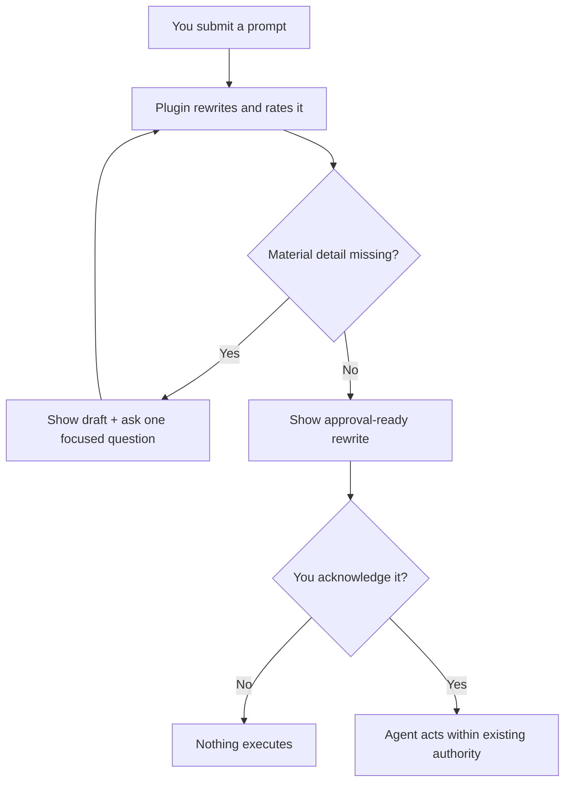

<h1 align="center">You Suck at Prompting</h1>

<p align="center">
  <strong>Your prompt has been called into a meeting. HR is here. There are slides.</strong><br>
  The mandatory performance review between your vague idea and an agent with tools.
</p>

<p align="center">
  
  
  
</p>

> [!WARNING]
> **Your prompt has been placed on a PIP.** “Make it better” is not a specification. It is a cry for help wearing business casual.

**You Suck at Prompting** is an installable customization for Codex, Claude Code, and VS Code GitHub Copilot Agent mode. It intercepts every task request for a brief disciplinary hearing: What are you asking for? Where? What counts as done? Who authorized the large red production button?

Then it visibly rewrites the task, identifies missing decisions, grades the original prompt, preserves explicit intent and authority boundaries, and waits for your acknowledgement before the agent begins. Your prompt may call this micromanagement. Your future incident report will call it personal growth.

The plugin adds execution controls only when the work needs them and asks instead of inventing material details. It adds no telemetry, credentials, external service, or new permissions. It is judgmental, not nosy.

<p align="center">
  <a href="#enroll-your-prompts-in-mandatory-training"><strong>Install</strong></a> ·
  <a href="#your-prompts-performance-review-has-comments"><strong>What it fixes</strong></a> ·
  <a href="#the-mandatory-remedial-training-module"><strong>How it works</strong></a> ·
  <a href="docs/behavior-and-safety.md"><strong>Safety and privacy</strong></a>
</p>

## Exhibit A: “Fix it.” arrives naked and confident

Two words. One verb. Zero evidence that a requirement ever lived here.

**Original prompt:**

```text
Fix it.
```

**The plugin:**

Analyzing whether You Suck at Prompting… your prompt’s performance review is underway.

Draft rewritten prompt:

```text
Investigate and fix [NEEDED: the specific failure or undesired behavior]
in [NEEDED: the affected application, repository, or file].

Keep the change limited to the identified problem and verify the fix with
the smallest relevant test or reproduction.
```

Prompt performance rating: 1/5 - This prompt arrived with a verb and left the rest in another tab.

What is broken, and where are you seeing it?

After the user names the failure, the plugin replaces the placeholders, shows the complete rewrite, and waits for acknowledgement. Clarification repairs the task, not the original grade; the polished rewrite earns no extra credit. HR keeps receipts.

See [two more prompts under formal review](docs/examples.md): a tiny file task that forgot its receipt and a production deployment that tried to enter the building with a casual `yes`.

## Your prompt’s performance review has comments

| Observed behavior | Performance finding | Corrective action |
|---|---|---|
| “Make it better.” | Better was not named, measured, or invited. | Name the outcome and success check. |
| “Deploy it.” | You handed a pronoun root access. | Identify the target and preserve a separate deployment approval. |
| “You know what I mean.” | The model has reviewed the record and objects. | State the detail that changes the result. |

Brevity is not misconduct. “Delete the obsolete fixture and rerun the unit tests” is brief. “Do the thing” is an abandonment of managerial duty.

## The mandatory remedial training module

Eight boxes now stand between your prompt and its next incident. This is called governance.



Prompt approval authorizes the displayed task within existing authority. It does not silently authorize publishing, deployment, purchase, deletion, disclosure, scheduling, or permission changes. The prompt may have improved; it has not been promoted to management.

Complex work gets bounded controls; routine direct work stays compact. We are cruel, not inefficient.

## Enroll your prompts in mandatory training

Choose the manager currently responsible for your agent:

**Codex:**

```powershell
codex plugin marketplace add ScotTFO/you-suck-at-prompting
codex plugin add you-suck-at-prompting@scottfo
```

**Claude Code:**

```powershell
claude plugin marketplace add ScotTFO/you-suck-at-prompting
claude plugin install you-suck-at-prompting@scottfo
```

Review the installed hook, then start a fresh task or session. VS Code GitHub Copilot requires the shared plugin plus an instruction adapter because three hosts agreeing on one installation process would violate an ancient treaty.

See the complete [installation, upgrade, Copilot, project-only, and smoke-test guide](docs/installation.md).

## Legal reviewed the jokes. Legal was right.

> [!IMPORTANT]
> **No new prompt destination:** the plugin has no telemetry, MCP server, external service, or credential requirement. Normal processing by your chosen host still applies. Again: judgmental, not nosy.

| The tiny bureaucrat does | The tiny bureaucrat is not authorized to do |
|---|---|
| Rewrites each new task into a visible, self-contained prompt. | Make a bad idea good. It can make the bad idea extremely well specified. |
| Recovers safely discoverable facts and marks unresolved material details. | Invent requirements, permissions, or user taste. Telepathy remains outside quarterly objectives. |
| Requires real verification evidence when completion needs proof. | Accept confidence as a test result merely because it owns expensive shoes. |
| Adds bounded execution controls only when material. | Create agents, schedules, persistence, tools, or host capabilities. An org chart is not a runtime. |
| Keeps prompt approval separate from consequential effects. | Smuggle permission to deploy, publish, purchase, delete, or disclose inside an acknowledgement. |

Codex and Claude Code use a constant-output hook that does not read, echo, store, or transmit the submitted prompt. Copilot uses a static instruction adapter instead. Real prompts are never retained automatically. The hook is not secretly reading your prompt while wearing a fake mustache.

<details>
<summary><strong>What if my prompt is already good?</strong></summary>

It rewrites it anyway. The one day we waive inspection is the day someone hides “quickly deploy” in a parenthetical.

</details>

<details>
<summary><strong>Can I disable it?</strong></summary>

Yes. Inspect and manage the hook or customization through your host. Free will remains technically supported.

</details>

<details>
<summary><strong>Will this make every result perfect?</strong></summary>

No. It improves the instructions and exposes missing decisions. Reality does not accept rewritten prompts as unit tests.

</details>

Read the full [behavior, safety, privacy, retention, and repository-boundary contract](docs/behavior-and-safety.md).

## Your prompt may return to work under supervision

Install the adult supervision your prompts have repeatedly demonstrated they need. If it prevents one request beginning with “just quickly,” star the repository and send it to the colleague you were five minutes ago.

MIT licensed. No prompts were promoted during this review.
