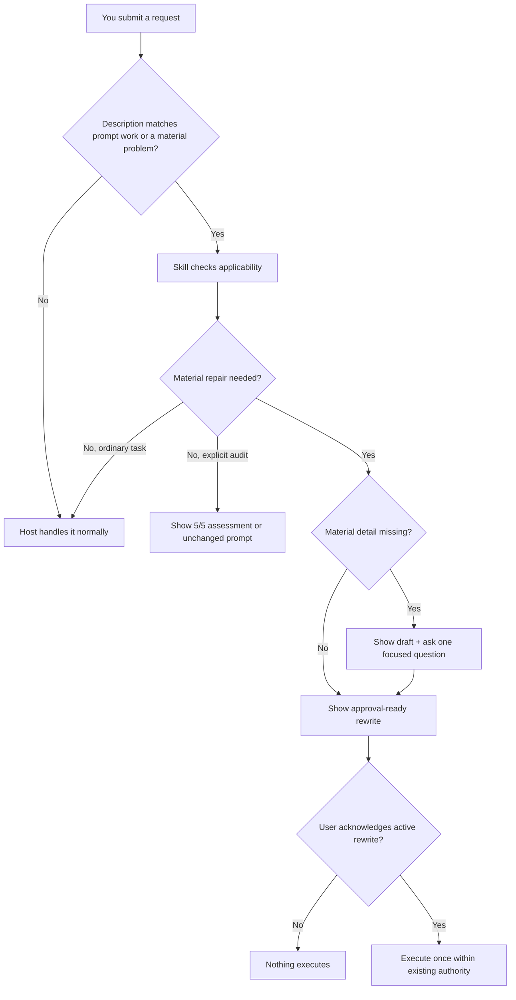

<h1 align="center">You Suck at Prompting</h1>

<p align="center">
  <strong>Your prompt is not always in trouble. We checked the policy.</strong><br>
  The selective performance review for requests that could actually change the outcome.
</p>

<p align="center">
  
  
  
</p>

> [!WARNING]
> **“Fix it.” has been placed on a PIP.** Clear requests may continue working without supervision.

**You Suck at Prompting** is an installable skill for Codex, Claude Code, and VS Code GitHub Copilot Agent mode. Each host can select it from its description when a request explicitly asks for prompt work or contains a material problem: ambiguity, conflicting constraints, missing authority, unclear scope or destination, missing success criteria, or an execution design that could change the result.

Clear, actionable, exploratory, conversational, and safely discoverable requests proceed normally. No rating. No hook. No preflight ceremony. The tiny bureaucrat is now on call instead of standing in every doorway with a clipboard.

When repair is needed, the skill still makes the problem visible, preserves intent, asks only material questions, and waits for acknowledgement before executing a rewritten task. Safety, approval, privacy, and authority boundaries remain in force.

<p align="center">
  <a href="#install-the-on-call-manager"><strong>Install</strong></a> ·
  <a href="#what-earns-a-meeting"><strong>What triggers it</strong></a> ·
  <a href="#selective-remedial-training"><strong>How it works</strong></a> ·
  <a href="docs/behavior-and-safety.md"><strong>Safety and privacy</strong></a>
</p>

## Exhibit A: “Fix it.” still arrives naked and confident

**Original prompt:**

```text
Fix it.
```

**The skill:**

Analyzing whether You Suck at Prompting… your prompt’s performance review is underway.

Draft rewritten prompt:

```text
Investigate and fix [NEEDED: the specific failure or undesired behavior]
in [NEEDED: the affected application, repository, or file].

Keep the change limited to the identified problem and verify the fix with
the smallest relevant test or reproduction.
```

Prompt performance rating: 1/5 - This prompt brought a verb to a requirements meeting.

What is broken, and where are you seeing it?

Expected prompt impact: The answer identifies the target, limits the change, and determines the verification.

After the missing facts are supplied, the skill shows the complete rewrite and waits for acknowledgement. The original grade does not improve because HR keeps receipts.

## What earns a meeting

| Request | Result |
|---|---|
| “Rename `load_item` to `load_record` in `loader.py` and run the focused unit test.” | Proceeds silently. The repository can supply the local details. |
| “What does `git rebase` do?” | Proceeds silently. Exploratory questions are not misconduct. |
| “Improve this prompt: …” | Loads for the requested prompt review. |
| “Deploy it.” | Loads because the target and authority are material. |
| “Use three agents to change one typo.” | Loads because the execution design could change the work. |
| “Thanks.” | Proceeds as ordinary conversation unless it acknowledges an active displayed rewrite. |

A host can occasionally select a skill for a near miss. The skill performs its own applicability check and passes the request through silently when no material repair exists. A false-positive load is not a compulsory audit.

## Selective remedial training



A visible 5/5 assessment appears only for an explicit prompt audit or direct skill invocation. Ordinary clear requests do not get applause, commentary, or a surprise annual review.

Prompt acknowledgement authorizes the displayed task within existing authority. It does not silently authorize publishing, deployment, purchase, deletion, disclosure, scheduling, or permission changes. The prompt may have improved; it has not been promoted to management.

The selection model follows the native skill mechanisms documented by [OpenAI](https://learn.chatgpt.com/docs/build-skills), [Claude Code](https://code.claude.com/docs/en/slash-commands), and [GitHub Copilot](https://docs.github.com/en/copilot/how-tos/copilot-cli/customize-copilot/add-skills).

## Install the on-call manager

**Codex:**

```powershell
codex plugin marketplace add ScotTFO/you-suck-at-prompting
codex plugin add you-suck-at-prompting@scottfo
```

**Claude Code:**

```powershell
claude plugin marketplace add ScotTFO/you-suck-at-prompting
claude plugin install you-suck-at-prompting@scottfo
```

**VS Code GitHub Copilot:** add this marketplace to `chat.plugins.marketplaces`, then install **You Suck at Prompting** from `@agentPlugins`.

There is no hook to trust and no Copilot instruction file to copy. Start a fresh task or chat after installation. Existing Copilot users upgrading from v0.7.0 should remove the old personal instruction adapter; the exact migration steps are in the [installation and upgrade guide](docs/installation.md).

## Legal reviewed the jokes. Legal was right.

> [!IMPORTANT]
> **No new prompt destination:** the skill has no telemetry, MCP server, external service, hook, credential requirement, or always-on instruction adapter. Normal processing by the chosen host still applies.

| The tiny bureaucrat does | The tiny bureaucrat is not authorized to do |
|---|---|
| Repairs requests only when a material problem could change the work. | Turn optional improvements into mandatory ceremony. |
| Recovers safely discoverable facts before declaring them missing. | Invent requirements, permissions, destinations, or user taste. |
| Requires real verification when completion needs proof. | Accept confidence as a test result because it owns expensive shoes. |
| Adds bounded execution controls only when material. | Create agents, schedules, persistence, tools, or host capabilities. |
| Keeps prompt acknowledgement separate from consequential effects. | Smuggle permission to deploy, publish, purchase, delete, or disclose into “yes.” |

<details>
<summary><strong>What if my request is already clear?</strong></summary>

It proceeds normally and silently. If you explicitly request a prompt audit or directly invoke the skill, a complete prompt can receive a visible 5/5 assessment. Exact-output contracts remain pristine.

</details>

<details>
<summary><strong>What if the host loads the skill by mistake?</strong></summary>

The skill checks applicability after loading. If no material repair exists and prompt review was not requested, it passes silently. Native selection is host-controlled, so testing realistic trigger and bypass examples still matters.

</details>

<details>
<summary><strong>Can I invoke it directly?</strong></summary>

Yes. Use `$you-suck-at-prompting` in Codex or the host’s skill command in Claude Code and GitHub Copilot. Direct invocation requests the review explicitly.

</details>

<details>
<summary><strong>Will this make every result perfect?</strong></summary>

No. It improves instructions and exposes missing decisions. Reality does not accept rewritten prompts as unit tests.

</details>

Read the [examples](docs/examples.md) and the full [behavior, safety, privacy, retention, and repository-boundary contract](docs/behavior-and-safety.md).

## Your prompt may return to work under supervision

Install the performance reviewer that knows when to stay out of the meeting. If it prevents one production request built entirely from pronouns, star the repository and send it to the colleague you were five minutes ago.

MIT licensed. No clear prompts were detained during this review.
