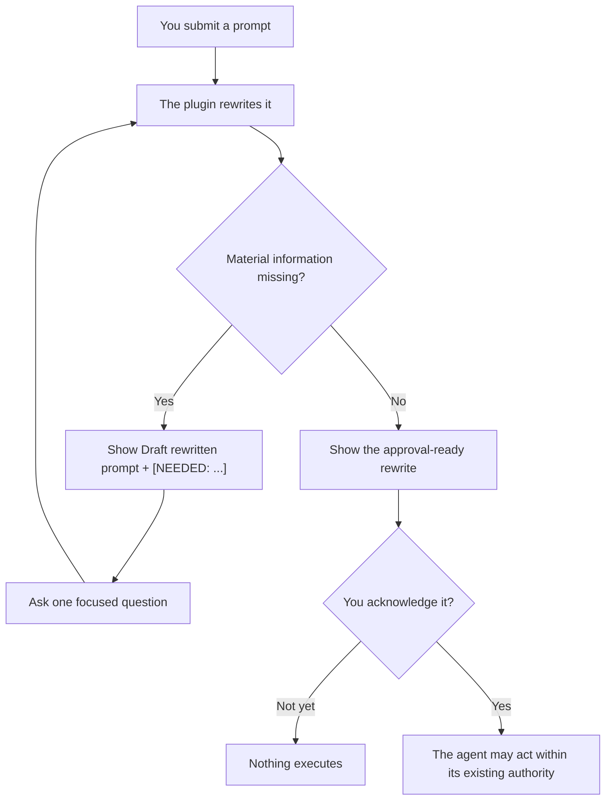

<h1 align="center">You Suck at Prompting</h1>

<p align="center">
  <strong>Good news: so do we.</strong><br>
  The plugin that gives every prompt adult supervision before your agent acts on it.
</p>

<p align="center">
  
  
  
  
</p>

<p align="center">
  <a href="#install-for-codex"><strong>Install for Codex</strong></a>
  ·
  <a href="#install-for-claude-code"><strong>Install for Claude Code</strong></a>
  ·
  <a href="#how-the-intervention-works"><strong>How it works</strong></a>
</p>

> [!WARNING]
> **Your prompt has been placed on a Performance Improvement Plan.**
>
> This is not punitive. We have all typed “make it better” and expected a machine to reconstruct the missing fourteen paragraphs from our tone.

**You Suck at Prompting** is an installable Codex and Claude Code plugin that visibly rewrites every task request before execution.

It preserves what you meant, identifies anything important you forgot, protects the authority boundaries you definitely remembered to specify, and waits for your approval before the agent does anything.

In other words: it turns this—

```text
Make it better and put it on GitHub.
```

—into something an agent can execute without consulting a psychic, a lawyer, and three previous versions of you.

## Exhibit A: a prompt moments before consequences

**You, radiating confidence:**

```text
Make the README funny and viral.
```

**The plugin, quietly putting on reading glasses:**

Analyzing whether You Suck at Prompting… your prompt’s performance review is underway.

You Suck At Prompting Rewritten prompt:

```text
Redesign the public GitHub README for the You Suck at Prompting plugin.

Use a polished, PG-13 self-roast voice that makes fun of our prompting
habits without insulting the reader. Preserve the verified installation,
privacy, permission, and behavior claims. Use native GitHub Markdown for
visual impact, make no plugin behavior changes, and provide the complete
draft for approval before publishing it.
```

Reply with an acknowledgement to use this prompt.

Nothing executes until you acknowledge the rewrite.

If something material is still missing, the plugin does not fill the gap with confidence-shaped fiction. It shows a draft containing an explicit marker such as:

```text
[NEEDED: target repository or destination]
```

Then it asks the smallest useful question. Revolutionary technology: admitting when information does not exist.

## Your Prompting Performance Improvement Plan

| Observed behavior | Professional translation | Corrective action |
|---|---|---|
| “Make it better.” | Better has left no forwarding address. | Define the intended outcome and success check. |
| “Fix the app.” | Which app? Which failure? Which dimension? | Recover safe context or mark the missing detail as `[NEEDED: ...]`. |
| “Deploy it.” | A side effect disguised as a pronoun. | Preserve the authority boundary and wait for approval. |
| Eleven paragraphs, no actual request | Context has achieved critical mass. | Produce one self-contained, executable prompt. |
| “You know what I mean.” | The machine regrets to inform you that it does not. | State the part that changes the result. |

> [!NOTE]
> Brevity is not the problem. “Delete the obsolete test fixture in this repository and rerun the unit tests” is short and useful.
>
> “Do the thing” is also short. It is less useful.

## How the intervention works



The plugin does this for every new task request, including requests that are already clear or trivial. You installed a prompt chaperone. It takes the position seriously.

## Install for Codex

```powershell
codex plugin marketplace add ScotTFO/you-suck-at-prompting
codex plugin add you-suck-at-prompting@scottfo
```

Review and trust the plugin hook when Codex prompts you. In Codex CLI, use `/hooks` to inspect and trust the exact command.

Start a new Codex task after installation or upgrade so the current skill and hook are loaded.

To upgrade:

```powershell
codex plugin marketplace upgrade scottfo
codex plugin add you-suck-at-prompting@scottfo
```

Then start a fresh task. Your old task has already seen too much.

## Install for Claude Code

```powershell
claude plugin marketplace add ScotTFO/you-suck-at-prompting
claude plugin install you-suck-at-prompting@scottfo
```

Use `/hooks` to inspect the installed `UserPromptSubmit` hook.

Start a new Claude Code session after installation or upgrade.

To upgrade:

```powershell
claude plugin marketplace update scottfo
claude plugin update you-suck-at-prompting@scottfo
```

## Use it deliberately

The shared `UserPromptSubmit` hook activates the visible rewrite gate for new task requests.

You can also invoke the skill directly when you want to audit, critique, clarify, or rewrite a prompt:

- **Codex:** `$you-suck-at-prompting`
- **Claude Code:** `/you-suck-at-prompting:you-suck-at-prompting`

When the hook is disabled or unavailable, model-driven implicit invocation remains a best-effort fallback.

A clear acknowledgement such as `approve`, `yes`, `go ahead`, `proceed`, or `looks good` executes the latest complete rewrite. Capitalization does not matter. We tested the possibility that someone might type `YES` with feeling.

Clarifications and qualifications revise the prompt and reset the approval gate. An unrelated request starts a new rewrite instead of resurrecting a prompt from three conversational lifetimes ago.

## What this tiny bureaucrat does

- Rewrites every new task request into a self-contained prompt.
- Preserves explicit goals, constraints, exclusions, and supplied context.
- Recovers facts that are safely discoverable before asking you questions.
- Marks unresolved material information instead of inventing it.
- Keeps prompt approval separate from permission to publish, deploy, delete, purchase, disclose, or change access.
- Waits for acknowledgement before execution.

## What it absolutely does not do

- Decide that your vague sentence secretly authorized production deployment.
- Turn “take a look” into “rewrite everything.”
- Treat a polished prompt as permission to send, publish, purchase, or delete.
- Add an MCP server, external service, telemetry, or credential requirement.
- Automatically modify your global instructions.
- Make a bad idea wise. It can only make the bad idea extremely well specified.

> [!IMPORTANT]
> **This plugin does not create a new destination for your prompts.**
>
> Normal Codex or Claude Code processing still applies. The plugin hook does not read, echo, store, or transmit the submitted prompt; it prints only a constant preflight instruction.

<details>
<summary><strong>Privacy, permissions, and the part where the responsible adults start nodding</strong></summary>

This plugin contains one shared skill and one shared `UserPromptSubmit` command hook. Codex and Claude Code discover them through their native plugin contracts.

The harness provides hook-event data on standard input, but the hook command never reads that input. It emits only a bounded, constant instruction telling the harness to display the rewrite gate.

The plugin has:

- no MCP server;
- no external service;
- no telemetry;
- no credential requirement; and
- no automatic modification of global instructions.

The Claude manifest intentionally relies on the default `hooks/hooks.json` discovery path. Declaring another hook path would cause Claude Code to merge both definitions and run the preflight twice, which is one intervention more than anyone requested.

Users can inspect and disable plugin hooks. Codex additionally requires explicit trust for non-managed hooks.

Installing or trusting this plugin does not grant authority to send, publish, purchase, schedule, deploy, delete, disclose information, or change permissions.

</details>

<details>
<summary><strong>Repository boundary</strong></summary>

This repository contains only the distributable plugin, its public documentation, hook tests, and package-validation CI.

Behavioral evaluation data and maintainer automation are not distributed with the plugin. Your installation does not arrive with a mysterious folder named `totally-not-telemetry`.

</details>

## Frequently avoided questions

### Does this plugin call me stupid?

No. The prompt is on a PIP. You are showing tremendous leadership by installing the PIP.

The skill critiques the request, never the person.

### What if my prompt is already good?

It rewrites it anyway.

You installed a plugin called **You Suck at Prompting**. Apparently neither of us wanted to take chances.

### Can I just type “yes”?

Yes. Also `approve`, `go ahead`, `proceed`, or `looks good`.

Human language remains supported pending budget approval.

### Will this make every agent result perfect?

No.

It improves the instructions, exposes missing decisions, and prevents accidental authority expansion. The agent can still misunderstand reality in exciting new ways.

### Can I disable the hook?

Yes. Inspect and manage installed hooks using your harness’s `/hooks` interface.

We believe in informed consent, including your right to return to freestyle prompting.

## Congratulations on seeking help

If this plugin saves you from shipping one prompt that begins with “just quickly,” consider starring the repository.

Then share it with the person you were five minutes ago.

## License

MIT. Improve your prompts irresponsibly responsibly.
