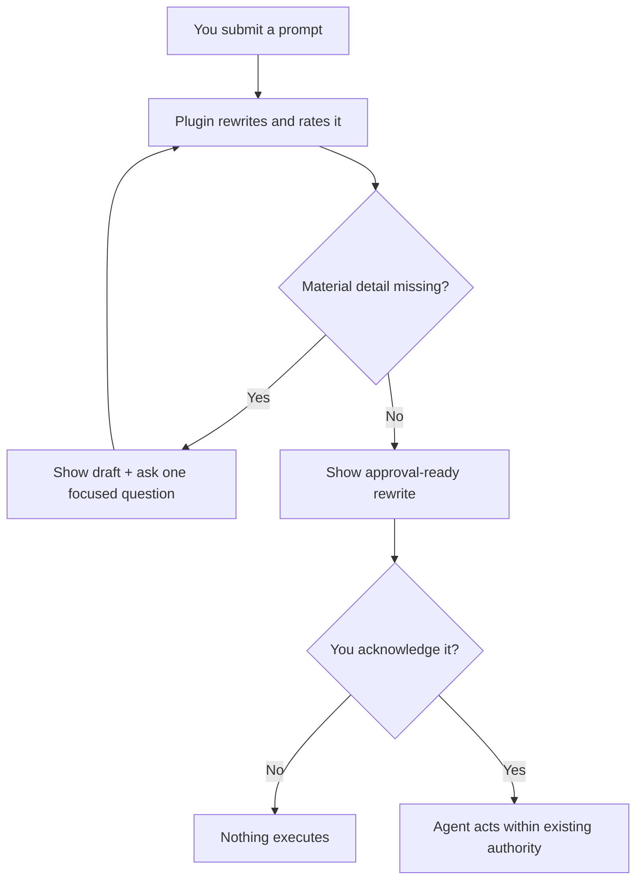

<h1 align="center">You Suck at Prompting</h1>

<p align="center">
  <strong>Your prompts are bad. Relax. Most are. This plugin makes them employable.</strong><br>
  Adult supervision for every task request before your agent acts on it.
</p>

<p align="center">
  
  
  
</p>

> [!WARNING]
> **Your prompt has been placed on a PIP.** “Make it better” is not a specification; it is a cry for help wearing business casual.

**You Suck at Prompting** is an installable customization for Codex, Claude Code, and VS Code GitHub Copilot Agent mode. It visibly rewrites every task request, identifies missing decisions, grades the original prompt, and waits for your acknowledgement before the agent begins.

It preserves explicit intent and authority boundaries, adds execution controls only when the work needs them, and asks instead of inventing material details. It does not add telemetry, credentials, an external service, or permission to touch the large red production button.

<p align="center">
  <a href="#install-the-intervention"><strong>Install</strong></a> ·
  <a href="#here-is-your-prompts-improvement-plan"><strong>What it fixes</strong></a> ·
  <a href="#how-the-intervention-works"><strong>How it works</strong></a> ·
  <a href="docs/behavior-and-safety.md"><strong>Safety and privacy</strong></a>
</p>

## Watch “Fix it” arrive without identification

Here is what happens when `Fix it` reports for duty with no badge, department, or discernible purpose.

**Original prompt:**

```text
Fix it.
```

**The plugin:**

Analyzing whether You Suck at Prompting… your prompt’s performance review is underway.

Draft rewritten prompt:

```text
Investigate and fix [NEEDED: the specific failure or undesired behavior]
in [NEEDED: the affected application, repository, or file].

Keep the change limited to the identified problem and verify the fix with
the smallest relevant test or reproduction.
```

Prompt performance rating: 1/5 - This prompt arrived with a verb and left the rest in another tab.

What is broken, and where are you seeing it?

After the user names the failure, the plugin replaces the placeholders, shows the complete rewrite, and waits for acknowledgement. The rating remains anchored to the original prompt; the polished rewrite earns no extra credit.

See [more synthetic examples](docs/examples.md) for a tiny file task and a production deployment that does not accept a casual `yes`.

## Here is your prompt’s improvement plan

| Observed behavior | Performance finding | Corrective action |
|---|---|---|
| “Make it better.” | Better has left no forwarding address. | Name the outcome and success check. |
| “Deploy it.” | A side effect disguised as a pronoun. | Identify the target and preserve a separate deployment approval. |
| “You know what I mean.” | The machine regrets to report that it does not. | State the detail that changes the result. |

Brevity is innocent. Missing requirements committed the crime.

## How the intervention works



Prompt approval authorizes the displayed task within existing authority. It does not silently authorize publishing, deployment, purchase, deletion, disclosure, scheduling, or permission changes. Apparently even approval needs adult supervision.

Complex work gets bounded controls; routine direct work stays compact.

## Install the intervention

**Codex:**

```powershell
codex plugin marketplace add ScotTFO/you-suck-at-prompting
codex plugin add you-suck-at-prompting@scottfo
```

**Claude Code:**

```powershell
claude plugin marketplace add ScotTFO/you-suck-at-prompting
claude plugin install you-suck-at-prompting@scottfo
```

Review the installed hook, then start a fresh task or session. VS Code GitHub Copilot requires the shared plugin plus an instruction adapter because one installation step would apparently have damaged morale.

See the complete [installation, upgrade, Copilot, project-only, and smoke-test guide](docs/installation.md).

## Safety, privacy, and other adult words

> [!IMPORTANT]
> **No new prompt destination:** the plugin has no telemetry, MCP server, external service, or credential requirement. Normal processing by your chosen host still applies.

| It does | It refuses to pretend it does |
|---|---|
| Rewrites each new task into a visible, self-contained prompt. | Make a bad idea good. It can make the bad idea extremely well specified. |
| Recovers safely discoverable facts and marks unresolved material details. | Invent requirements, permissions, or user taste. |
| Requires real verification evidence when completion needs proof. | Treat confidence as a test result wearing expensive shoes. |
| Adds bounded execution controls only when material. | Create agents, schedules, persistence, tools, or host capabilities. |
| Keeps prompt approval separate from consequential effects. | Convert acknowledgement into permission to deploy, publish, purchase, delete, or disclose. |

Codex and Claude Code use a constant-output hook that does not read, echo, store, or transmit the submitted prompt. Copilot uses a static instruction adapter instead. Real prompts are never retained automatically.

<details>
<summary><strong>What if my prompt is already good?</strong></summary>

It rewrites it anyway. You installed a plugin called **You Suck at Prompting**; neither of us came here to gamble.

</details>

<details>
<summary><strong>Can I disable it?</strong></summary>

Yes. Inspect and manage the hook or customization through your host. Informed consent includes your right to return to freestyle prompting.

</details>

<details>
<summary><strong>Will this make every result perfect?</strong></summary>

No. It improves the instructions and exposes missing decisions. The agent can still misunderstand reality in exciting new ways.

</details>

Read the full [behavior, safety, privacy, retention, and repository-boundary contract](docs/behavior-and-safety.md).

## Congratulations on seeking help

Install the adult supervision your prompts have repeatedly demonstrated they need. If it prevents one request beginning with “just quickly,” consider starring the repository and sharing it with the person you were five minutes ago.

MIT licensed. Improve your prompts irresponsibly responsibly.
